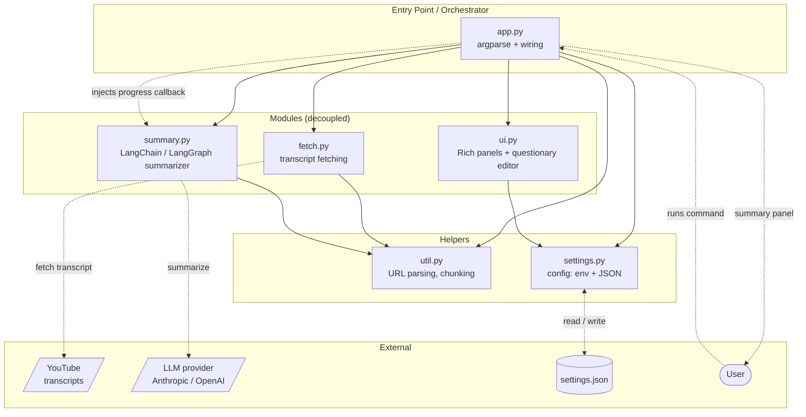

# YouTube Summarizer

A small command-line tool that turns a YouTube link into a concise summary: paste a URL, get the gist in your terminal without watching the whole thing.

## What it does

Give it a YouTube URL (or just the video id). It pulls the video's transcript, sends it to a language model to summarize, and renders the result as a clean panel in your terminal. Short videos are summarized in one pass; long ones are split into chunks, summarized in parallel, and stitched back together. The model is swappable: Anthropic by default, OpenAI or others via a single setting.

```bash
yt-summarize "https://youtu.be/U93EPbwyrUA"
```

## Features

**Summarize**
- Accepts any YouTube URL shape: `watch?v=`, `youtu.be/`, `/shorts/`, `/embed/`, `/live/`, share links with `?si=…`, or a bare 11-character id
- Pulls human or auto-generated captions via [`youtube-transcript-api`](https://pypi.org/project/youtube-transcript-api/)
- Short transcript → single-pass summary; long transcript → LangGraph map-reduce over chunks
- Tune the output: `--style` (bullets or paragraph) and `--length` (short, medium, long)

**Model-agnostic**
- Backend chosen at runtime from a `provider:model` string via LangChain's `init_chat_model`
- Defaults to `anthropic:claude-haiku-4-5`; switch to `openai:gpt-4o-mini` (or anything else) with one flag or setting

**Configurable**
- Non-secret preferences persist as JSON; secrets stay in the environment
- Interactive `--settings` editor (arrow-key menus) to change preferences without hand-editing files
- Layered config: per-run flags override environment, which overrides the JSON file, which overrides defaults

**Terminal UI**
- Summaries, transcripts, and errors render as [Rich](https://pypi.org/project/rich/) panels
- A spinner and progress lines report what's happening during long map-reduce runs

## Installation

Requires [`uv`](https://docs.astral.sh/uv/) and Python ≥3.12.

**Install from GitHub** (callable from anywhere as `yt-summarize`):

```bash
uv tool install --reinstall git+https://github.com/frnnk/youtube-description
```

Re-run the same command anytime to pull the latest commit. `--reinstall` forces uv to rebuild from source: without it, a second run sees the tool is already installed and does nothing, leaving you on old code. The flag is harmless on a first install.

After installing, `uv` will tell you if its bin directory isn't on `PATH` yet; follow its hint (typically `uv tool update-shell`, then restart your terminal) so the `yt-summarize` command is reachable.

**Set an API key.** The key is a secret, so it lives in the environment, not the config file. Export the one variable matching your model's provider, or an error will be thrown. The variable name is fixed per provider:

| Provider | Environment variable | Key format |
|---|---|---|
| Anthropic | `ANTHROPIC_API_KEY` | `sk-ant-...` |
| OpenAI | `OPENAI_API_KEY` | `sk-proj-...` or `sk-...` |
| Google (Gemini) | `GOOGLE_API_KEY` | `AIza...` |

Append the line for your provider to your shell startup file, then reload it. Paste the **entire** key, not a truncated snippet: the `...` below is a placeholder for the full string the provider gave you (typically 40 or more characters), and a partial key authenticates to nothing.

```bash
echo 'export ANTHROPIC_API_KEY="sk-ant-your-full-key-here"' >> ~/.bashrc   # Anthropic
echo 'export OPENAI_API_KEY="sk-proj-your-full-key-here"'   >> ~/.bashrc   # OpenAI
echo 'export GOOGLE_API_KEY="AIza-your-full-key-here"'      >> ~/.bashrc   # Google
source ~/.bashrc
```

**Point the model at your key.** The default model is `anthropic:claude-haiku-4-5`. If you supplied an OpenAI or Google key instead, you must tell the tool which model to use, otherwise it will try the default Anthropic model and fail with a missing-key error. Run the interactive editor once after installing to set the model to match your provider:

```bash
yt-summarize --settings        # set "model" to e.g. openai:gpt-4o-mini or google_genai:gemini-2.0-flash
```

This persists the choice so every later run uses it. To override for a single run instead, pass `--model provider:model`.

**Dev workflow** (run from a local clone, picks up code changes immediately):

```bash
git clone https://github.com/frnnk/youtube-description
cd youtube-description
uv sync
uv run yt-summarize "https://youtu.be/U93EPbwyrUA"
```

**Uninstall**: `uv tool uninstall youtube-summarizer`

## Usage

```bash
yt-summarize "URL"                          # summarize with your saved preferences
yt-summarize "URL" --style paragraph        # prose instead of bullets
yt-summarize "URL" --length long            # more thorough
yt-summarize "URL" --model openai:gpt-4o-mini   # use a different model for this run
yt-summarize "URL" -l es -l en              # prefer Spanish captions, fall back to English
yt-summarize "URL" --show-transcript        # also print the raw transcript
yt-summarize --settings                     # open the interactive preferences editor
yt-summarize --config ./settings.dev.json "URL"   # use a specific config file
```

The `url` is positional: quote it so the shell doesn't choke on `?` and `&`.

| Flag | Description |
|---|---|
| `--model` | Model id as `provider:model` (e.g. `anthropic:claude-haiku-4-5`, `openai:gpt-4o-mini`) |
| `-l`, `--language` | Preferred caption language code; repeatable, in priority order |
| `--style` | `bullets` or `paragraph` |
| `--length` | `short`, `medium`, or `long` |
| `--show-transcript` | Print the raw transcript before the summary |
| `--config PATH` | Use a specific JSON config file for this run |
| `--settings` | Open the interactive preferences editor, then exit |

> **Captions required.** Summaries are built from the video's transcript, so a video with captions disabled (or none auto-generated yet) can't be summarized. The tool reports this clearly rather than guessing.

## Configuration

Two kinds of configuration, kept deliberately separate:

| Kind | Where it lives | Examples |
|---|---|---|
| **Secrets** | environment / `.env` | `ANTHROPIC_API_KEY`, `OPENAI_API_KEY` |
| **Preferences** | JSON config file | `model`, `temperature`, `chunk_chars`, `summary_style`, `summary_length`, `languages` |

**Editing preferences.** Run `yt-summarize --settings` for an interactive editor, or hand-edit the JSON. Saves are atomic: the file is never left half-written.

**Config file resolution** (first match wins):

| Order | Location | Use |
|---|---|---|
| 1 | `--config PATH` flag, or `YTS_CONFIG` env var | explicit override |
| 2 | `./settings.dev.json` in the current directory | repo-local dev config |
| 3 | `~/.config/youtube-summarizer/settings.json` | per-user config (cross-platform via [`platformdirs`](https://pypi.org/project/platformdirs/)) |

The user-level file is created automatically by `--settings`. The dev file is created by hand (copy `settings.example.json` to `settings.dev.json`) and is git-ignored.

**Precedence** (highest first): per-run CLI flags → environment variables (`YTS_*`) → `.env` → JSON config file → built-in defaults. So a `--model` flag beats a `YTS_MODEL` env var, which beats the model saved in JSON.

## Architecture



Solid arrows are code dependencies (imports). Dotted arrows are runtime flow. The design rule: only `app.py` imports the feature modules (`fetch`, `summary`, `ui`); the modules never import each other. When one needs another's behavior, `app.py` wires it in. For example, it injects `ui.progress_callback` into `summary.summarize` so the summarizer can report progress without importing `ui`. The helpers (`util`, `settings`) are plain shared utilities any module may import.

## Project structure

```
src/youtube_summarizer/
  __init__.py     -- package marker
  app.py          -- CLI entry point: argparse, orchestration, error handling
  fetch.py        -- transcript fetching; normalizes failures to TranscriptError
  summary.py      -- model-agnostic summarizer; stuff vs LangGraph map-reduce
  ui.py           -- Rich rendering + the questionary settings editor
  util.py         -- URL → video id, transcript joining, word-boundary chunking
  settings.py     -- config resolution, JSON load/atomic save, env precedence
tests/
  test_summary.py -- manual summarizer smoke test (needs an API key)
settings.example.json  -- template for settings.dev.json
pyproject.toml    -- project metadata, dependencies, console script, build backend
uv.lock           -- pinned dependency versions
```

## Requirements

- Python ≥3.12
- An API key for your chosen model provider (`ANTHROPIC_API_KEY` or `OPENAI_API_KEY`)
- A network connection (transcripts are fetched from YouTube; summaries call the provider's API)

## License

[MIT](LICENSE)
